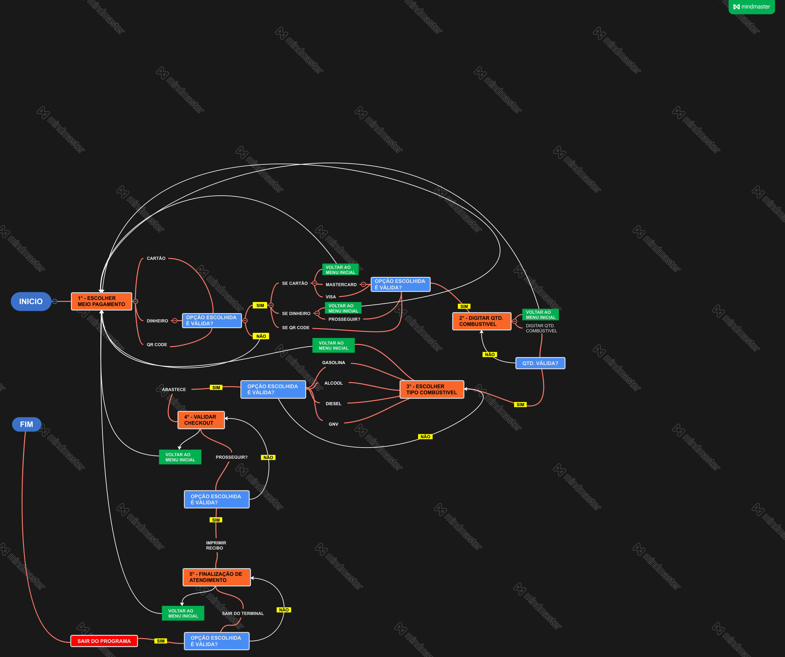

```
Título: LABORATÓRIO PYTHON - PRÁTICA 1
Autor: MAURILIO CARDOSO GONÇALVES
Data: 28/07/21
Sistema Operacional: Unix Like
```
---
BLOCOS DE TRANSIÇÃO: <br>
[MEIO_PAGAMENTO](#mp) <br>
[QUANTIDADE_COMBUSITOVEL](#qc) <br>
[TIPO_COMBUSTIVEL](#tc) <br>
[CONFIRMAR_CHECKOUT](#cc) <br>
[FINALIZAR_SESSAO](#fs)
---

# LABORATÓRIO PYTHON - POSTO DE COMBÚSTIVEL
## PRÉ-REQUISITOS
* PYTHON 3 OU SUPERIOR
* S.O UNIX LIKE 

## MODELO CLIENTE


## MAPA MENTAL


## CONDIÇÕES DE TESTE (CT) E CASOS DE TESTE (CAT) 
### CT_01
<a id="mp" name="mp"></a> 
* No menu o usuario seleciona MEIO_PAGAMENTO
#### CAT
```
 CT_01_CAT_01
 O menu deve apresentar 3 opções
-----------------------------------------------------------------
 CT_01_CAT_02 
 Se cartão, então seleciona bandeira
    
    CT_01_CAT_02.1 
    O menu deve apresentar 3 opções
   
    CT_01_CAT_02.2
    Se bandeira válida, passa para QUANTIDADE_COMBUSTIVEL
----------------------------------------------------------------- 
 CT_01_CAT_03
 Se QR Code verdadeiro, passa para QUANTIDADE_COMBUSTIVEL
----------------------------------------------------------------- 
 CT_01_CAT_04
 Se dinheiro, passa para QUANTIDADE_COMBUSTIVEL
    
    CT_01_CAT_04.1
    O menu deve apresentar 2 opções
    
    CT_01_CAT_04.2
    Se escolher prosseguir, passa para QUANTIDADE_COMBUSTIVEL
```
### CT_02
<a id="qc" name="qc"></a> 
* No menu usuario seleciona a QUANTIDADE_COMBUSTIVEL
#### CAT
``` 
 CT_02_CAT_01
 O menu deve apresentar 2 opções
 
    CT_02_CAT_01.01
    Usuário deve informar QUANTIDADE_COMBUSTIVEL entre um intervalo válido 
    
 2. CT_02_CAT_02
 Se QUANTIDADE_COMBUSTIVEL válida, passa para TIPO_COMBUSTIVEL
```

### CT_03
<a id="tc" name="tc"></a>
* No menu usuario seleciona o TIPO_COMBUSTIVEL
#### CAT
```
 CT_03_CAT_01
 O menu deve apresentar 5 opções

 CT_03_CAT_02
 Se TIPO_COMBUSTIVEL válido, passa para CONFIRMAR_CHECKOUT
```

### CT_04
<a id="cc" name="cc"></a> 
* Contador Timeout aparece na tela, usuário valida visualmente infomações e CONFIRMAR_CHECKOUT
#### CAT
```
-----------------------------------------------------------------
 CT_04_CAT_01
 Timeout da sessão é 30 segundos e informações de checkout aparecem na tela
 
    CT_04_CAT_01.1
    O menu deve apresentar 2 opções
    
 CT_04_CAT_02
 Se usuário não CONFIRMAR_CHECKOUT sessão expira automaticamente
-----------------------------------------------------------------
 CT_04_CAT_03
 Se CONFIRMAR_CHECKOUT válido, abastece, imprime recibo e passa para FINALIZAR_SESSAO
```

### CT_05
<a id="fs" name="fs"></a> 
* Usuario recebe mensagem de conclusão e escolhe FINALIZAR_SESSAO ou voltar ao inicio
#### CAT
```
-----------------------------------------------------------------
 CT_05_CAT_01
 O menu deve apresentar 2 opções
 
    CT_05_CAT_01.1
    Se FINALIZAR_SESSAO, sai do programa
-----------------------------------------------------------------
```