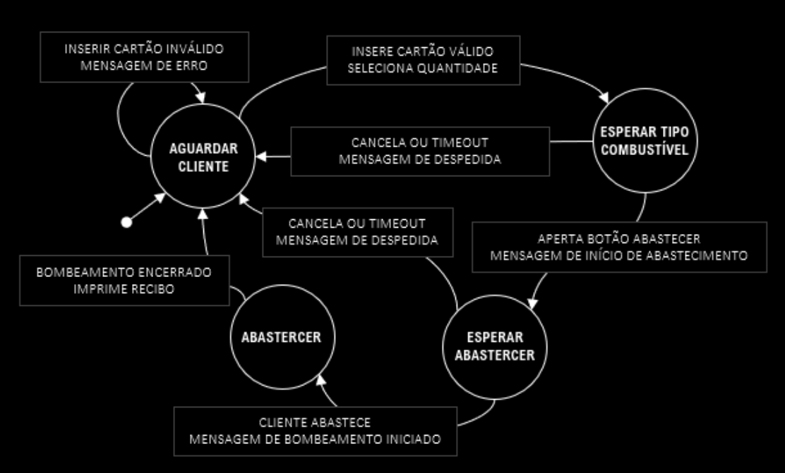

```
Título: LABORATÓRIO PYTHON - PRÁTICA 1
Autor: MAURILIO CARDOSO GONÇALVES
Data: 28/07/21
output: html document
```
---
BLOCOS DE TRANSIÇÃO: <br>
<a name="MP">MEIO_PAGAMENTO<a/> <br>
<a name="QC">QUANTIDADE_COMBUSTIVEL</a> <br>
<a name="TC">TIPO_COMBUSTIVEL</a> <br>
<a name="CC">CONFIRMA_CHECKOUT</a><br>
<a name="FS">FINALIZA_SESSAO</a>
---

# LABORATÓRIO PYTHON - POSTO DE COMBÚSTIVEL
## PRÉ-REQUISITOS
* PYTHON 3 OU SUPERIOR

## MODELO DO PROJETO


## CONDIÇÕES DE TESTE (CT) E CASOS DE TESTE (CAT) 
### CT_01
* No menu o usuario seleciona [MEIO_PAGAMETO](MP)
#### CAT
```
 CT_01_CAT_01
 O menu deve apresentar 4 opções
-----------------------------------------------------------------
 CT_01_CAT_02 
 Se cartão, então passar para selecionar bandeira
    
    CT_01_CAT_02.1 
    O meu deve apresentar 3 opções
   
    CT_01_CAT_02.2
    Se cartão e bandeira válidos, passar para QUANTIDADE_COMBUSTIVEL
----------------------------------------------------------------- 
 CT_01_CAT_03
 Se QR Code verdadeiro, passar para QUANTIDADE_COMBUSTIVEL

 CT_01_CAT_04
 Se dinheiro, passar para QUANTIDADE_COMBUSTIVEL
```
### CT_02
* No menu usuario seleciona a QUANTIDADE_COMBUSTIVEL
#### CAT
```
 1. CT_02_CAT_01
 Usuário deve informar QUANTIDADE_COMBUSTIVEL entre um intervalo válido

 2. CT_02_CAT_02
 Se QUANTIDADE_COMBUSTIVEL válido, passar para TIPO_COMBUSTIVEL
```

### CT_03
* No menu usuario seleciona o TIPO_COMBÚSTIVEL
#### CAT
```
 CT_03_CAT_01
 O menu deve apresentar 5 opções

 CT_03_CAT_02
 Se TIPO_COMBUSTIVEL válido, passar para CONFIRMAR_CHECKOUT
```

### CT_04
* Contador Timeout aparece na tela, usuário valida visualmente infomações e CONFIRMAR_CHECKOUT
#### CAT
```
-----------------------------------------------------------------
 CT_04_CAT_01
 Timeout da sessão é 30 segundos e informações de checkout aparecem na tela
 
    CT_04_CAT_01.1
    O menu deve apresentar 3 opções
    
    CT_04_CAT_01.2
    Se usuário não CONFIRMAR_CHECKOUT sessão expira automaticamente
-----------------------------------------------------------------
 CT_04_CAT_02
 Se CONFIRMAR_CHECKOUT válido, abastecer e passar para FINALIZAR_SESSAO
```

### CT_05
* Usuario recebe mensagem de conclusão e escolhe FINALIZAR_SESSAO ou voltar ao inicio
#### CAT
```
-----------------------------------------------------------------
 CT_05_CAT_01
 O menu deve apresentar 2 opções
 
    CT_05_CAT_01.1
    Se FINALIZAR_SESSAO, imprime recibo e sai do programa
-----------------------------------------------------------------
```